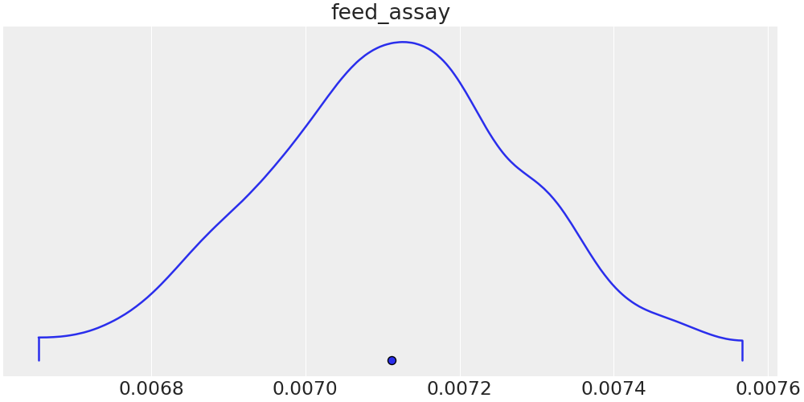

# Bicyclus minimal working example
This MWE will show the basics on how Bicyclus can be used.
We consider a very simple fuel cycle with a uranium source, an enrichment
facility, and two repositories for enriched and depleted uranium, respectively.

The goal in this scenario is to reconstruct the enrichment grade of the feed
uranium (the feed assay) through measurement of the total depleted uranium mass.
For simplicity, all other parameters are kept constant.

## File overview
The different files used are
- `run.py`: Driver file, where the specific behaviour is defined (what to
  extract from each simulation, how to calculate likelihoods, ...)
- `cyclus_input.json`: Base Cyclus input file.
  This could also be an `.xml` or `.py` file.
- `true_parameters.json`: The 'true' parameters, i.e., the ones used to generate
  the ground truth.
- `sampled_parameters.json`: The prior distributions of the sampled parameters.
- `*.png`: The visualised reconstruction results. Below, it is explained how
  these can be obtained.

## How-to
This MWE can be tested by running `python3 run.py`.
Using the following arguments (four chains of 200 samples each, run on 4
cores in parallel):
```bash
$ python3 run.py \
    --run BicyclusExample \
    --sample-parameters-file sample_parameters.json \
    --true-parameters-file true_parameters.json \
    --algorithm default \
    --cores 4 \
    --chains 4 \
    --iterations 1 \
    --samples 200 \
    --tuning-samples 100 \
    --rel-sigma 0.5 \
    --debug # Print log to CLI, don't store log in a separate file.
```
we get a successful reconstruction within approximately half an hour (wallclock
time).

To combine the four chains (i.e., four independent reconstructions) into one
final result and to visualise said result, run (from within this directory)
`$ python3 ../bicyclus/visualize/merge.py NAME_OF_OUTPUTFILE.cdf`.
We get the following density plot:

Note how the prior density (uniform on 0.0065 to 0.01) got restricted to a much
narrower distribution located between approximately 0.0067 to 0.0076.
As we have not fixed a seed, this distribution might look slightly different
than yours.
