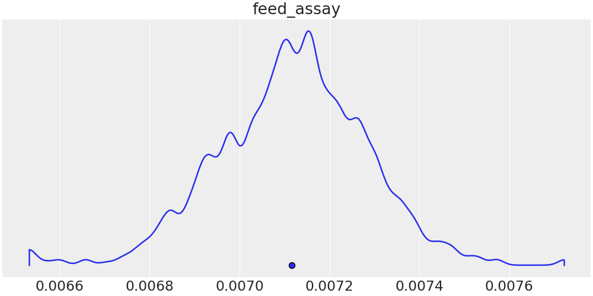

# Bicyclus minimal working example
This MWE will show the basics on how Bicyclus can be used.
We consider a very simple fuel cycle with a uranium source, an enrichment
facility, and two repositories for enriched and depleted uranium, respectively.

The goal in this scenario is to reconstruct the enrichment grade of the feed
uranium (the feed assay) through measurement of the total depleted uranium mass.
For simplicity, all other parameters are kept constant.

## File overview
The different files used are
- `run.py`: Driver file, where the specific behaviour is defined (what to
  extract from each simulation, how to calculate likelihoods, ...)
- `cyclus_input.json`: Base Cyclus input file.
  This could also be an `.xml` or `.py` file.
- `start_reconstruction.sh`: Sample script to start an inference process.
- `parameters/`
  - `true_parameters.json`: The 'true' parameters, i.e., the ones used to
    generate the ground truth.
  - `sampled_parameters.json`: The prior distributions of the sampled
    parameters.
- `plots/*.png`: The visualised reconstruction results. Below, it is explained
  how these can be obtained.

## How-to
This MWE can be tested by running `$ ./start_reconstruction.sh`.
In this example, we use four chains of 200 samples each, run on 4
cores in parallel, to perform the inference (which takes some time, say, 30 to
90 minutes).

To combine the four chains (i.e., four independent reconstructions) into one
final result and to visualise said result, run (from within this directory)
`$ python3 ../bicyclus/visualize/merge.py NAME_OF_OUTPUTFILE.cdf` [^1].
We get the following density plot:

Note how the prior density (uniform on 0.0065 to 0.01) got restricted to a much
narrower distribution located between approximately 0.0067 to 0.0076.
As we have fixed the seed, you should be able to reproduce this distribution
exactly [^2].

[^1]: Please note that you may need to install `bicyclus` using the `[plotting]`
  option to ensure that all dependencies are available.

[^2]: Please note that we have not yet been able to test the software on
  different OS or different machines. We _think_ this does not influence
  reproducibility but we cannot guarantee it.
